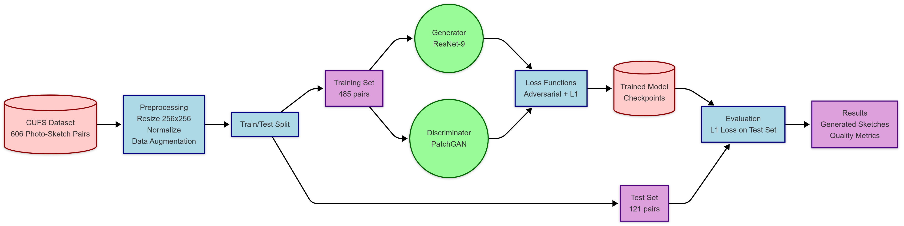
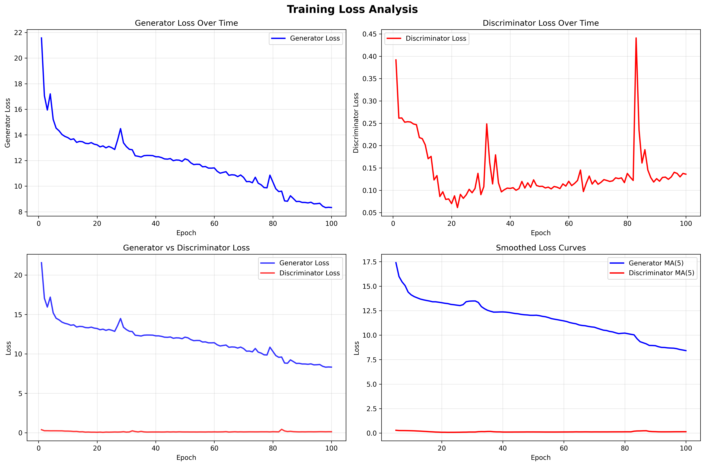
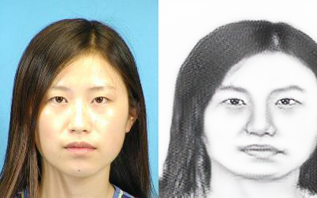
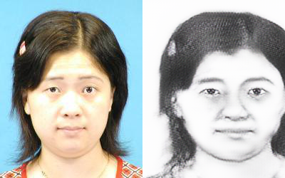
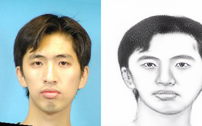
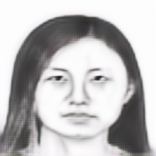
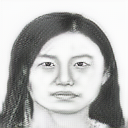
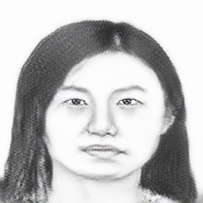
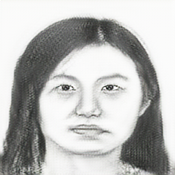

# Photo to Sketch Conversion using Deep Learning

A deep learning project that converts face photos to artistic sketches using Generative Adversarial Networks (GANs). This implementation uses a Pix2Pix GAN architecture with ResNet-9 Generator and PatchGAN Discriminator.

<div align="center">

</div>

## 🎯 Project Overview

This project implements an image-to-image translation system that transforms face photographs into artistic pencil sketches. The model is trained on the CUFS (Chinese University Face Sketch) dataset and achieves high-quality sketch generation with preserved facial features.

### Key Features

- **Pix2Pix GAN Architecture**: ResNet-9 Generator + PatchGAN Discriminator
- **High-Quality Output**: 256x256 pixel sketch generation
- **Real-time Inference**: Fast sketch generation from photos
- **Comprehensive Training Tools**: Monitoring, analysis, and visualization
- **Modular Design**: Easy to extend and modify

## 🏗️ Architecture

### Generator (ResNet-9)
- Encoder-Decoder structure with skip connections
- 9 ResNet blocks for feature transformation
- Instance Normalization for stable training
- Input: 3×256×256 RGB photo → Output: 3×256×256 sketch

### Discriminator (PatchGAN)
- 70×70 patch-level classification
- Convolutional layers with LeakyReLU activation
- MSE Loss (LSGAN approach)
- Evaluates local image patches for realism

## 📊 Results

### Training Performance (100 Epochs)
- **Generator Loss Improvement**: 61.4%
- **Discriminator Loss Improvement**: 65.3%
- **Total Training Time**: 0.74 hours
- **Average Epoch Time**: 26.8 seconds

<div align="center">

</div>

### Sample Results

<div align="center">

**Sample 1: High-quality sketch conversion**


**Sample 2: Preserved facial features**


**Sample 3: Artistic style transfer**


</div>

### Quality Progression During Training

The model shows clear improvement in sketch quality throughout training:

<div align="center">

| Epoch 18 | Epoch 67 | Epoch 90 | Epoch 99 |
|:--------:|:--------:|:--------:|:--------:|
|  |  |  |  |

</div>

## 🚀 Quick Start

### Prerequisites

- Python 3.8+
- CUDA-capable GPU (recommended)
- 4GB+ GPU memory

### Installation

1. **Clone the repository**
```bash
git clone https://github.com/yourusername/photo-to-sketch.git
cd photo-to-sketch
```

2. **Install dependencies**
```bash
pip install -r requirements.txt
```

3. **Download the dataset** (optional, for training)
```bash
python download_dataset.py
```

### Usage

#### Generate Sketch from Photo

```bash
python inference.py \
    --checkpoint checkpoints/pix2pix_cufs_enhanced/checkpoint_epoch_100.pth \
    --input_photo path/to/your/photo.jpg \
    --output_sketch output/sketch.png
```

#### Train Your Own Model

```bash
python train.py
```

#### Generate Sample Results

```bash
python generate_samples.py \
    --checkpoint checkpoints/pix2pix_cufs_enhanced/checkpoint_epoch_100.pth \
    --input_dir dataset/CUFS/test_photos \
    --output_dir sample_results
```

## 📁 Project Structure

```
photo-to-sketch/
├── README.md                 # Project documentation
├── requirements.txt          # Python dependencies
├── .gitignore               # Git ignore rules
├── train.py                 # Main training script
├── inference.py             # Single image inference
├── networks.py              # GAN architecture definitions
├── dataset.py               # Dataset loading utilities
├── generate_samples.py      # Batch sample generation
├── analyze_training.py      # Training analysis tools
├── monitor_training.py      # Real-time training monitor
├── visualize_training.py    # Training visualization
├── evaluate_checkpoints.py  # Model evaluation
├── discriminator_evaluation.py # Discriminator analysis
├── download_dataset.py      # Dataset download utility
├── checkpoints/             # Trained model weights
│   └── pix2pix_cufs_enhanced/
│       ├── checkpoint_epoch_100.pth
│       └── logs/
├── results/                 # Training progress images
├── sample_results/          # Generated sample outputs
│   ├── sketches/
│   └── comparisons/
└── docs/                    # Documentation and reports
    ├── PROJE_RAPORU.html
    ├── diagram.png
    ├── loss_analysis.png
    └── training_curves.png
```

## 🔧 Advanced Usage

### Training Configuration

Key hyperparameters in `train.py`:

```python
IMG_SIZE = 256        # Input/output image size
BATCH_SIZE = 4        # Batch size for training
NUM_EPOCHS = 100      # Number of training epochs
LR = 2e-4            # Learning rate
LAMBDA_L1 = 100.0    # L1 loss weight
```

### Monitoring Training

Real-time training monitoring:
```bash
python monitor_training.py --log_file checkpoints/pix2pix_cufs_enhanced/logs/training_log.txt
```

### Analyzing Results

Comprehensive training analysis:
```bash
python analyze_training.py --checkpoint_dir checkpoints/pix2pix_cufs_enhanced
```

## 🎨 Technical Details

### Loss Functions

1. **Generator Loss**: Combination of adversarial and L1 losses
   - Adversarial Loss: Fools the discriminator
   - L1 Loss: Preserves image structure and details

2. **Discriminator Loss**: Binary classification loss
   - Real vs. Fake patch classification
   - MSE loss for stable training

### Data Preprocessing

- Images resized to 256×256 pixels
- Normalization to [-1, 1] range
- Data augmentation during training
- Paired photo-sketch alignment

## 📈 Performance Metrics

- **Generator Loss**: Measures sketch quality and realism
- **Discriminator Loss**: Measures ability to distinguish real vs. fake
- **L1 Loss**: Measures pixel-wise similarity to ground truth
- **Training Time**: Optimized for efficient GPU utilization

## 🔬 Research Background

This project is based on the Pix2Pix paper:
> Isola, P., et al. (2017). "Image-to-Image Translation with Conditional Adversarial Networks." CVPR.

Key improvements:
- Enhanced training monitoring and visualization
- Comprehensive evaluation metrics
- Modular and extensible codebase
- Real-time inference capabilities

## 🤝 Contributing

Contributions are welcome! Please feel free to submit a Pull Request. For major changes, please open an issue first to discuss what you would like to change.

## 📄 License

This project is licensed under the MIT License - see the [LICENSE](LICENSE) file for details.

## 🙏 Acknowledgments

- CUFS Dataset: Chinese University of Hong Kong
- Pix2Pix Architecture: Berkeley AI Research Lab
- PyTorch Framework: Facebook AI Research

## 📞 Contact

**Ehsan Amini**
- Department: Software Engineering
- Email: [u201118076@samsun.edu.tr]

---

*This project was developed as part of a Deep Learning course assignment, demonstrating practical application of GANs for image-to-image translation tasks.*
